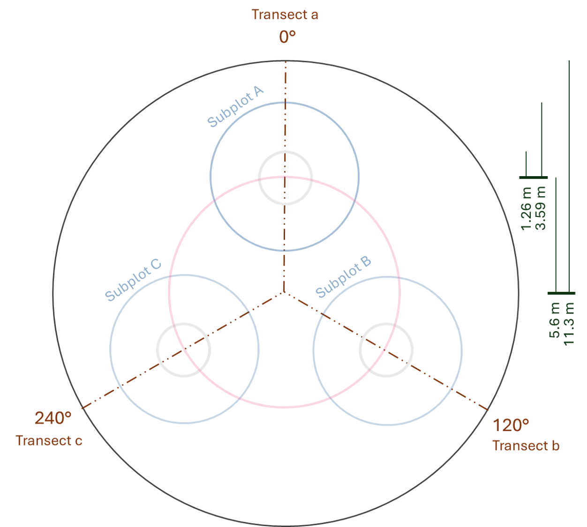

```{r setup, include=FALSE}
knitr::opts_chunk$set(echo = TRUE)
```

```{r pressure, echo=FALSE}
#plot(pressure)
```

## Introduction <!-- Tim -->

## Methods: Data collection <!--  -->

Forest composition was sampled throughout the PMRC land parcel through the selection of survey plots that provide a representative sample of the local ecosystem and terrain diversity. Plots were designed using a method resembling that set forth in the USDA Forest Inventory and Analysis (FIA) plot design[^1]. See Figure 1 for a visual reference.

[^1]: Bechtold, William, A.; Scott, Charles T. 2005. The forest inventory and analysis plot design. Gen. Tech. Rep. SRS-80. Asheville, NC: U.S. Department of Agriculture, Forest Service, Southern Research Station, p. 37-52

{width="295"} The 11.3-meter-radius plot is divided into 3 transect lines at 120 degree increments. Each transect line possesses a 3.59-meter-radius subplot, centered at 5.6 meters from the plot center.

Some data points were collected only on features residing within one of the 3 subplots or along the 3 transects, while others were measured throughout the entirety of the plot area. Measurements of trees, maple sap tubing, wildlife tracks, and tree-related microhabitats occurred throughout the entire plot. Understory composition, bryophytes, and coarse woody debris were primarily measured along the transect lines. Macrofungi measurements occurred within the 3 subplots.

## Results

### Vegetation structure <!-- Garrett -->

As shown in Figure 2 below, the plots predominately contain sugar maple, with sizeable fractions of American beech and yellow birch.

```{r}
source("01_read_data.R")
require ("ggplot2")
require ("forcats")
hist_counts <- as.data.frame(table(d_tree$spp))
hist_counts <- hist_counts[order(-hist_counts$Freq),]
rownames(hist_counts) <- NULL
ggplot(head(hist_counts, 12), aes(x = reorder(Var1, -Freq), y=Freq)) + geom_bar(stat="identity") + labs(title="Fig 2. Top Tree Species", x="Species", y="Counts (across all plots)") + theme(axis.text.x = element_text(angle = 90, vjust = 0.5, hjust=1))
```

#### Tree growth <!-- Sophie -->

#### Coarse Woody Debris <!-- Teaghan -->

### Vegetation composition <!-- Teaghan -->

### Tree-related Microhabitats (TreMs) <!-- Teaghan -->

### Understory composition <!-- Walt -->

#### Bryophytes <!-- Walt -->

### Macrofungi <!-- Emma -->

### Tubing <!-- Naya -->

### Wildlife <!-- Naya -->

## To sugar or not to sugar <!-- Tim -->
